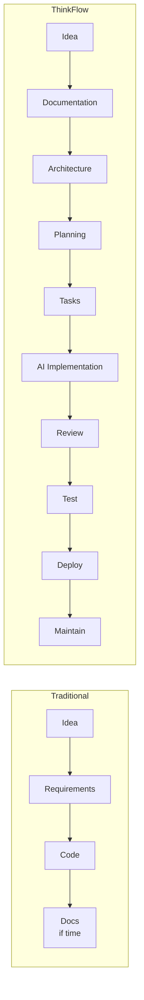
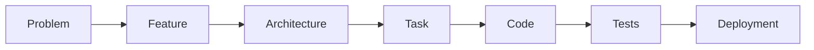

# ThinkFlow

**A documentation-first methodology for AI-native software engineering.**

ThinkFlow is not a programming course and not another AI coding assistant. It is an
engineering *operating system* — a way for developers, teams, and organizations to **think,
plan, document, architect, build, review, test, ship, and maintain** software with AI agents
as collaborators.

It sits in the same category as Agile, Scrum, Shape Up, the Twelve-Factor App, and
Architecture Decision Records — but it is focused entirely on **agentic software engineering**.

> **Core belief:** *Documentation is the source of truth.*
> Every AI action originates from structured documentation — never from a throwaway prompt.

ThinkFlow is deliberately **tool-agnostic**. It should work the same whether your agent is
Claude Code, Cursor, Codex, Copilot, Gemini CLI, OpenHands, a local model, or something that
doesn't exist yet. The methodology is meant to outlive any single tool.

---

## The idea in one diagram

Traditional development treats documentation as an afterthought. ThinkFlow inverts that:
documentation comes *first* and drives everything downstream.

Every document exists for a purpose, has defined inputs and outputs, and feeds another
document. Nothing is written without **traceability**:

---

## Principles at a glance

1. **Documentation First** — everything begins with a document.
2. **Human-Led** — humans decide; AI executes.
3. **AI as Collaborator** — augment engineering thinking, never replace it.
4. **Traceability** — every artifact links back to the problem it serves.
5. **Reproducibility** — two teams following ThinkFlow produce comparable results.
6. **Continuous Documentation** — docs evolve *with* the project, not after it.

Full write-up: [`docs/principles/`](docs/principles/principles.md).

---

## How to use ThinkFlow

1. **Read the philosophy** — [`docs/principles/philosophy.md`](docs/principles/philosophy.md).
2. **Learn the lifecycle** — [`docs/methodology/lifecycle.md`](docs/methodology/lifecycle.md)
   shows every stage from *Idea* to *Retrospective*.
3. **Understand a stage** — every stage doc follows the same 17-part shape defined in
   [`docs/methodology/stage-anatomy.md`](docs/methodology/stage-anatomy.md). The
   [Requirements stage](docs/methodology/stages/requirements.md) is the fully worked exemplar.
4. **Grab templates** — start real documents from [`docs/templates/`](docs/templates/).
5. **Assign agents** — map work to specialized AI roles in [`docs/agents/`](docs/agents/agent-model.md).
6. **Follow a workflow** — e.g. [New Feature](docs/workflows/new-feature.md).
7. **See it end-to-end** — the [Todo example](examples/todo/README.md) documents a whole
   project and shows the traceability chain in action.

---

## Repository map

| Path | What lives here |
|------|-----------------|
| [`docs/principles/`](docs/principles/) | Philosophy and the 6 guiding principles |
| [`docs/methodology/`](docs/methodology/) | The lifecycle, the stage anatomy, and per-stage docs |
| [`docs/templates/`](docs/templates/) | Reusable, fill-in-the-blank document templates |
| [`docs/agents/`](docs/agents/) | The agent model and specialized AI role definitions |
| [`docs/workflows/`](docs/workflows/) | End-to-end workflows (New Feature, Bug Fix, …) |
| [`docs/checklists/`](docs/checklists/) | Stage and gate checklists |
| [`examples/`](examples/) | Full projects documented start to finish |
| [`GLOSSARY.md`](GLOSSARY.md) | Shared vocabulary |
| [`CONTRIBUTING.md`](CONTRIBUTING.md) | How to extend the methodology consistently |

---

## ThinkFlow Studio (the companion app)

**[ThinkFlow Studio](https://waseemabbaspk.github.io/ThinkFlow/)** is an interactive, entirely
client-side web app that walks you through the five core stages —
**Vision → Requirements → Architecture → Tasks → Testing** — while keeping the traceability
chain honest for you. It auto-assigns IDs (`US-1`, `AC-1.1`, `ADR-2`, `TASK-7`, `TEST-12`), lets
you link artifacts upstream, and renders a **live traceability matrix** that flags gaps (an
untested criterion, an orphan task, a goalless story). Your project auto-saves to the browser's
local storage, and you can export the whole thing as Markdown docs (a `.zip`) or a portable
`.json` you can re-import later.

- **Live app:** https://waseemabbaspk.github.io/ThinkFlow/ — the repository root is the
  methodology; this Pages site is the Studio app.
- **Source:** [`app/`](app/) (React + Vite + TypeScript, no backend).

The app deploys automatically from [`app/`](app/) to GitHub Pages on every push to `main`
(see [`.github/workflows/deploy-studio.yml`](.github/workflows/deploy-studio.yml)). This requires
a **one-time** repo setting: **Settings → Pages → Build and deployment → Source = "GitHub Actions"**.

---

## Project status

ThinkFlow is under active construction. **Milestone 1 (this release) is a "foundation
vertical"**: a real, usable spine where every category — principle, stage, template, agent,
workflow, checklist, example — has at least one fully built exemplar, plus the framework docs
that define the patterns.

Breadth comes next: the remaining lifecycle stages, the full agent roster, more workflows, and
additional worked examples (e-commerce, banking, ERP, chatbot, SaaS, fraud detection). See
[`CONTRIBUTING.md`](CONTRIBUTING.md) for how to help fill them in.

---

## License

The ThinkFlow methodology (documentation and templates) is licensed under
[Creative Commons Attribution 4.0 International (CC BY 4.0)](LICENSE). Use it, adapt it, and
build on it — just give credit.
