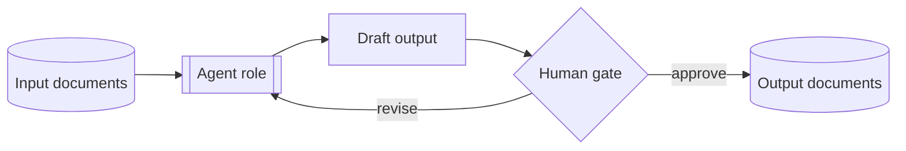

# The Agent Model

> **Purpose:** Define what a ThinkFlow "agent" is, how agents relate to humans, and the template
> every agent role follows.
> **Owner:** Methodology maintainers.
> **Written:** Foundational.
> **Changes:** when the agent contract changes.
> **Inputs:** [`../principles/principles.md`](../principles/principles.md).
> **Outputs:** the role definitions in [`roles/`](roles/).
> **Dependencies:** [`../../GLOSSARY.md`](../../GLOSSARY.md).

## What an agent is (and isn't)

A ThinkFlow **agent** is a *specialized role* you assign to an AI, defined by the documents it
consumes and produces and the decisions it is **not** allowed to make on its own. An agent is a
job description, not a tool — the same role can be played by Claude Code, Cursor, Codex, Copilot,
a local model, or a future tool. That is deliberate: roles outlive tools.

Crucially, **agents execute; humans decide** (Principle 2, *Human-Led*). Every agent has one or
more **human approval gates** — points where a human must review and accept before work
continues. An agent that can make an irreversible decision with no gate is misdefined.



## Why roles, not one big assistant

Giving an AI a *narrow, well-grounded role* beats a vague "do everything" prompt for the same
reasons documentation-first works: focused context produces better output, and a named role has
a named human accountable for its gate. A Security Agent reading the threat-relevant docs will
out-review a general assistant asked to "check for security issues" at the end.

## The agent-definition template

Every file in [`roles/`](roles/) follows this structure:

```markdown
# <Role> Agent

> Purpose / Owner (human gate-keeper) / Inputs / Outputs

## Purpose
one sentence — the value this role adds.

## Responsibilities
the concrete things this agent does.

## Inputs (documents consumed)
which documents it must read to work well.

## Outputs (documents produced)
what it creates or edits.

## Context required
the grounding it needs beyond the input docs (conventions, constraints, prior decisions).

## Human approval gates
the point(s) where a human must approve before work proceeds. At least one, always.

## Boundaries (must NOT do)
decisions this agent may draft but never finalize on its own.

## Prompt starter
a provider-neutral prompt that puts the AI into this role.
```

## The Milestone-1 roster

Fully defined exemplars in this release:

- [Business Analyst Agent](roles/business-analyst.md) — turns scope/goals into requirements.
- [Architect Agent](roles/architect.md) — proposes structure and records decisions.
- [QA Agent](roles/qa.md) — turns acceptance criteria into tests and hunts for gaps.

Planned (Milestone 2+): Planner, Product Manager, Research, Backend, Frontend, Database,
Security, Reviewer, Documentation, DevOps, Release, Maintenance. Add them using the template
above and register them here.

## Orchestrating agents across a workflow

Agents don't work in isolation — a [workflow](../workflows/workflow-spec.md) sequences them and
places the human gates. See [New Feature](../workflows/new-feature.md) for a worked example of
several agents handing documents to one another with humans approving at each gate.
