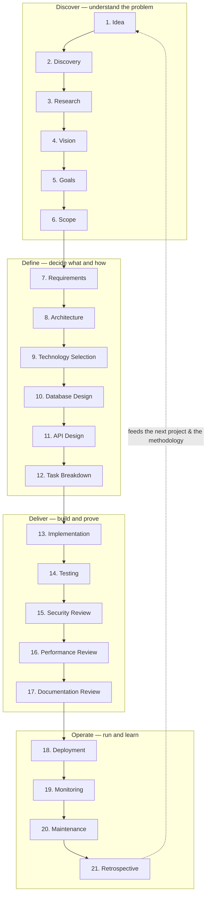
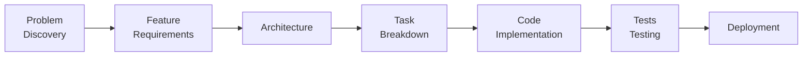

# The ThinkFlow Lifecycle

> **Purpose:** Lay out the complete ordered set of stages a project moves through, and how each
> stage's outputs feed the next.
> **Owner:** Methodology maintainers.
> **Written:** Foundational.
> **Changes:** When stages are added, removed, or reordered.
> **Inputs:** [`../principles/principles.md`](../principles/principles.md), [`stage-anatomy.md`](stage-anatomy.md).
> **Outputs:** [`stages/`](stages/) documents; every [workflow](../workflows/) references this.
> **Dependencies:** [`../../GLOSSARY.md`](../../GLOSSARY.md).

ThinkFlow organizes work into **21 stages**, from the first spark of an idea to the
retrospective that improves the next project. The lifecycle is a *default order*, not a rigid
waterfall: stages loop, revisit, and overlap. What is fixed is that each stage consumes defined
inputs and produces defined outputs, so the chain of intent is never broken.

## Lifecycle at a glance

## The stages

Each stage below gives its **Purpose** and its primary **Inputs → Outputs**. The full
[stage anatomy](stage-anatomy.md) (17 parts) is documented per stage under [`stages/`](stages/).
In Milestone 1, [Requirements](stages/requirements.md) is fully built; the rest are being filled
in (see the [stages index](stages/README.md)).

### Discover

1. **Idea** — Capture the raw spark and its motivation before it's lost or over-shaped.
   *Inputs:* a person's insight, a customer signal. *Outputs:* an Idea brief.
2. **Discovery** — Explore the problem space: who has this problem, how they solve it today,
   how big it is. *Inputs:* Idea brief. *Outputs:* problem statement, stakeholder map.
3. **Research** — Investigate prior art, technical feasibility, and unknowns.
   *Inputs:* problem statement. *Outputs:* research findings, feasibility notes, open questions.
4. **Vision** — State the desired future and why it matters; the north star.
   *Inputs:* problem statement, research. *Outputs:* Vision doc.
5. **Goals** — Turn vision into measurable objectives and success metrics.
   *Inputs:* Vision. *Outputs:* business goals, success metrics.
6. **Scope** — Draw the boundary: what's in, what's out, what's later.
   *Inputs:* Goals. *Outputs:* scope statement, constraints, non-goals.

### Define

7. **Requirements** — Specify what the software must do as user stories + acceptance criteria.
   *Inputs:* Scope, Goals. *Outputs:* requirements doc (IDs), acceptance criteria.
   → [Fully documented](stages/requirements.md).
8. **Architecture** — Decide the high-level structure and record the key decisions (ADRs).
   *Inputs:* Requirements, constraints. *Outputs:* system design, ADRs.
9. **Technology Selection** — Choose languages, frameworks, and services, with rationale.
   *Inputs:* Architecture, constraints. *Outputs:* tech stack decision (ADRs).
10. **Database Design** — Model the data: entities, relationships, and access patterns.
    *Inputs:* Requirements, Architecture. *Outputs:* data model, schema, migration plan.
11. **API Design** — Define the contracts between components and with the outside world.
    *Inputs:* Requirements, Architecture, data model. *Outputs:* API specification.
12. **Task Breakdown** — Decompose the work into small, traceable, independently shippable tasks.
    *Inputs:* Requirements, design docs. *Outputs:* task list (each traced to a requirement ID).

### Deliver

13. **Implementation** — Build the software, task by task, with agents doing the drafting and
    humans steering. *Inputs:* tasks, design docs. *Outputs:* code, updated docs.
14. **Testing** — Prove each acceptance criterion; catch regressions.
    *Inputs:* acceptance criteria, code. *Outputs:* tests (traced to `AC` IDs), test report.
15. **Security Review** — Assess and remediate security risks before shipping.
    *Inputs:* code, architecture, data model. *Outputs:* security findings + remediations.
16. **Performance Review** — Verify the system meets its performance and cost targets.
    *Inputs:* Goals (targets), code. *Outputs:* performance report, optimizations.
17. **Documentation Review** — Confirm documentation is current, complete, and traceable.
    *Inputs:* all docs, code. *Outputs:* sign-off that docs match reality.

### Operate

18. **Deployment** — Release to users safely and repeatably.
    *Inputs:* passing build, ops runbook. *Outputs:* deployed release, release notes.
19. **Monitoring** — Observe the running system; detect problems early.
    *Inputs:* deployed system, Goals. *Outputs:* dashboards, alerts, incident triggers.
20. **Maintenance** — Fix, patch, and evolve the system while keeping docs true.
    *Inputs:* monitoring signals, new requirements. *Outputs:* changes (each traced), updated docs.
21. **Retrospective** — Reflect on what worked and what didn't; improve the process.
    *Inputs:* the whole project record. *Outputs:* lessons learned, methodology improvements.

## How stages connect (traceability)

The Outputs of each stage are the Inputs of the next, forming the chain that makes any artifact
traceable end to end:

Because of this wiring, you can pick any task, code change, or test and walk backward to the
problem it serves — the property that makes the system safe for humans and agents to evolve.
See the [Todo example](../../examples/todo/README.md) for the chain instantiated on a real project.
