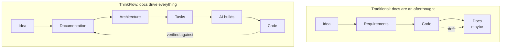
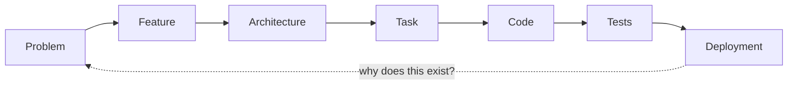

# Philosophy

> **Purpose:** Explain *why* ThinkFlow puts documentation before code and what that changes.
> **Owner:** Methodology maintainers.
> **Written:** Foundational — read this first.
> **Changes:** When the core philosophy is refined.
> **Inputs:** —
> **Outputs:** [`principles.md`](principles.md), the whole methodology.
> **Dependencies:** [`GLOSSARY.md`](../../GLOSSARY.md).

## The problem with prompt-driven development

AI coding agents are astonishingly capable, and that capability creates a trap. It is now
trivial to type a sentence and get working code back. So teams do exactly that — thousands of
times — and end up with a codebase that no single document explains, no human fully
understands, and no agent can safely change, because the *intent* behind the code was never
written down. It lived in a chat window and then evaporated.

The bottleneck in agentic engineering is no longer typing speed. It is **intent, context, and
verification**: knowing what to build, giving the agent enough grounding to build it well, and
being able to check that what came back is right. All three are documentation problems.

## Documentation is the source of truth

ThinkFlow's founding move is to invert the traditional order.

In ThinkFlow, **code is a derivation of documentation**, not the other way around. The
documents are the authoritative record of intent. Code, tests, and infrastructure are
*outputs* generated — by humans and agents together — from that record. When code and docs
disagree, the docs are what we reason about, and one of the two is fixed deliberately.

This is not bureaucracy. It is the opposite: it is the minimum structure that lets you hand
real work to an agent and trust the result.

## Why this works especially well with AI

Three properties of AI agents make documentation-first pay off far more than it did in the
purely human era:

1. **Agents thrive on context.** A well-grounded agent produces dramatically better output
   than one working from a one-line prompt. Documentation *is* portable, reusable context —
   write it once, feed it to every agent, every session, every tool.
2. **Agents are cheap to re-run, expensive to misdirect.** The costly failure mode is an agent
   confidently building the wrong thing. A document that states the requirement and its
   acceptance criteria turns "did it do the right thing?" from a judgment call into a check.
3. **Agents forget; documents don't.** Context windows end. Documentation is the memory that
   survives across sessions, tools, and team members — the thing that makes work *reproducible*.

## What documentation-first does NOT mean

- It does **not** mean writing a giant spec up front and freezing it. Documentation is
  *continuous* — it evolves with the project (see principle 6 in [`principles.md`](principles.md)).
- It does **not** mean more documents. It means the *right* documents, each with a purpose,
  inputs, and outputs. A document nobody consumes is waste and should be deleted.
- It does **not** mean humans stop thinking and let the AI write the docs unsupervised. Humans
  own the decisions; documentation is where those decisions are recorded and made testable.

## The payoff: traceability

Because every document declares its inputs and outputs, the whole project becomes a traceable
chain. You can start anywhere and walk in either direction:

Ask of any line of code, "why does this exist?" and the answer is a task; the task traces to a
requirement; the requirement to a feature; the feature to a problem. Ask of any problem, "is it
handled?" and you can walk forward to the tests that prove it. That is the property that makes a
codebase safe to evolve — with humans and agents alike.

Continue to the [six guiding principles →](principles.md)
