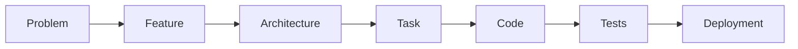

# The Six Guiding Principles

> **Purpose:** State the principles every ThinkFlow practice must uphold, with the reasoning
> behind each and how it shows up in daily work.
> **Owner:** Methodology maintainers.
> **Written:** Foundational.
> **Changes:** Rarely — only when a principle is added, removed, or sharpened.
> **Inputs:** [`philosophy.md`](philosophy.md).
> **Outputs:** Every stage, template, agent, and workflow cites these.
> **Dependencies:** [`GLOSSARY.md`](../../GLOSSARY.md).

These six principles are the constitution of ThinkFlow. Any practice, template, or automation
that violates one is wrong, no matter how convenient.

---

## 1. Documentation First

**Everything begins with a document.** No architecture without a requirements doc; no code
without a task; no task without a requirement it satisfies.

**Why.** The expensive failure in agentic engineering is an agent building the wrong thing
quickly. A document that states intent turns verification from a judgment call into a check,
and turns one-off context into reusable context.

**In practice.**
- Before prompting an agent to build something, point it at the document that defines it.
- If a document doesn't exist yet, writing it *is* the first task — not a detour.
- A document that no downstream document consumes is deleted, not archived.

---

## 2. Human-Led

**Humans make decisions. AI executes them.** Direction, trade-offs, and acceptance are human
responsibilities. Drafting, generating, and refactoring are where agents do the heavy lifting.

**Why.** Accountability cannot be delegated to a model. Someone must own the choice to ship,
the trade-off between cost and speed, the call on an acceptable risk. Keeping humans on the
decisions is also what keeps the system *steerable* as agents get more capable.

**In practice.**
- Every agent definition names at least one **human approval gate**.
- Agents propose; humans dispose. A generated ADR is a *draft decision* until a human accepts it.
- "The AI decided" is never an acceptable answer to "why is it this way?"

---

## 3. AI as Collaborator

**Augment engineering thinking; never replace it.** ThinkFlow is not about removing engineers
from the loop — it is about giving them a tireless collaborator for the parts that scale poorly
with human attention.

**Why.** The goal is leverage, not abdication. Teams that offload *thinking* to the model
produce work they can't explain or maintain. Teams that offload *toil* to the model while
keeping the thinking produce more and understand it better.

**In practice.**
- Use agents for breadth (drafting many options, exhaustive checklists, boilerplate) and humans
  for judgment (which option, what matters, when it's good enough).
- If an engineer can't explain what the agent produced, the work isn't done.
- Treat agent output as a strong draft to be reviewed, never as a finished authority.

---

## 4. Traceability

**Every artifact links back to the problem it serves and forward to what it produces.**

**Why.** Traceability is what makes a system safe to change. When you can walk from any line of
code back to the requirement and forward to the test that proves it, you can evaluate the impact
of a change instead of guessing — and so can an agent.

**In practice.**
- Requirements, stories, criteria, tasks, and tests all carry **IDs** (`US-3`, `AC-3.2`, `TASK-7`).
- Every document header lists its Inputs and Outputs.
- Nothing is written without a traceable reason to exist.

---

## 5. Reproducibility

**Two teams following ThinkFlow should produce comparable results.** The methodology is a
recipe, not a personality.

**Why.** A practice that only works for its author isn't a methodology — it's a habit.
Reproducibility is also what lets a *new* team member or a *fresh* agent session pick up the
work without re-deriving all the context from scratch.

**In practice.**
- Stages have explicit entry/exit criteria, so "done" doesn't depend on who's asking.
- Templates and the stage anatomy give the same shape to every project's documents.
- A fresh agent, handed only the documents, should be able to continue the work.

---

## 6. Continuous Documentation

**Documentation evolves with the project — it is living, not a one-time artifact.**

**Why.** Front-loaded specs rot the moment reality diverges from them, and rotted docs are
worse than none because they mislead. Documentation-first only works if the docs stay true.

**In practice.**
- When a decision changes, the document changes in the same change-set — not "later".
- Every workflow includes a "documentation updated?" checkpoint before merge.
- Stale docs are a defect. Treat a doc/code disagreement like a failing test.

---

## Using the principles

When two good practices conflict, resolve the conflict by asking which choice better upholds
these principles — in this priority order when they genuinely clash: **Human-Led** and
**Traceability** first (they protect accountability and safety), then **Documentation First**,
**Continuous Documentation**, **AI as Collaborator**, and **Reproducibility**. In practice they
rarely fight; most of the time upholding one reinforces the rest.
