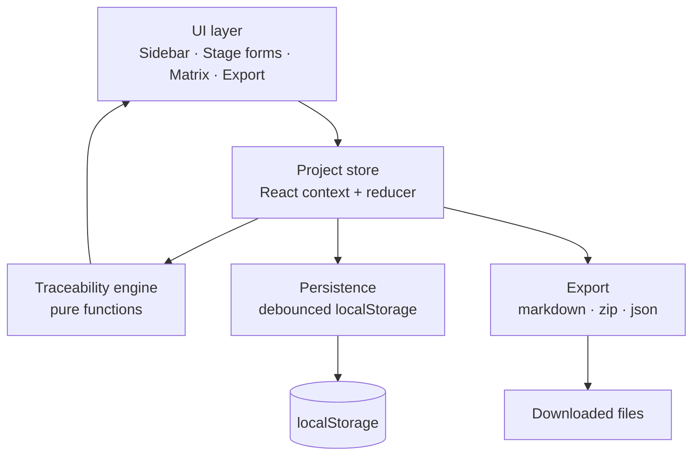

# ThinkFlow Studio — Design Spec

**Date:** 2026-07-27
**Status:** Approved (design); pending implementation plan
**Author:** ThinkFlow maintainers

## Context

ThinkFlow is a documentation-first, tool-agnostic methodology for AI-native software
engineering (see the repo root and `docs/`). Milestone 1 shipped the methodology as markdown:
principles, a 21-stage lifecycle, a 17-part stage anatomy, templates, agent roles, workflows,
checklists, and a Todo example that demonstrates an end-to-end traceability chain.

Reading a methodology is not the same as *practising* it. **ThinkFlow Studio** is an interactive
web app that guides a user through the built lifecycle stages, actively manages the traceability
that makes ThinkFlow distinctive, and exports a complete, template-conformant documentation set
the user can drop straight into a repo. It teaches the methodology by making people *do* it.

The purpose of this spec is to define what v1 of ThinkFlow Studio is, precisely enough to write
an implementation plan against it.

## Goals

- Let a single user, with no account and no backend, walk through the 5 built ThinkFlow stages
  and produce real documents.
- Actively enforce and visualize **traceability** (IDs and links across stages) with a live
  matrix and gap detection.
- Export documentation that matches the existing repo templates exactly.
- Persist work automatically in the browser and allow portability via a project file.
- Deploy free as a static site on GitHub Pages from the existing repo.

## Non-goals (v1)

- No accounts, authentication, multi-user, collaboration, or backend/database.
- No direct GitHub push/OAuth integration (candidate for a later milestone).
- No coverage of the 16 lifecycle stages that have no template yet.
- No rich WYSIWYG markdown editing — structured forms only.
- No mobile-first design (must be usable on a laptop; responsive is a bonus, not a requirement).

## Decisions (resolved during brainstorming)

| Decision | Choice | Rationale |
|----------|--------|-----------|
| App type | Interactive lifecycle tool | Chosen over docs site / SaaS. |
| Save & output | Auto-save to `localStorage` + per-file/zip markdown export + JSON project file | Zero infra; mirrors the methodology's own [ADR-1](../../../examples/todo/03-architecture.md). |
| Stage scope (v1) | The 5 built stages: Vision → Requirements → Architecture/ADR → Tasks → Testing | Only these have templates; they form the full traceability chain. |
| Traceability | Full: auto-IDs + linking UI + live matrix + gap detection | This is ThinkFlow's core value; the tool enforces the discipline. |
| Stack & host | React + Vite + TypeScript, GitHub Pages | Standard, type-safe, component-based, free hosting. |
| Navigation | Hybrid workspace (stage sidebar; jump anywhere; gate/status shown) | Matches "stages loop, not waterfall"; better than a strict wizard. |
| Location | `app/` subfolder of the existing ThinkFlow repo | Keeps docs pristine; one repo to manage. |
| Name | ThinkFlow Studio | Approved. |

## Architecture overview

A fully client-side single-page application. All state lives in the browser; there is no server.



The **Project store** is the single source of truth. The UI dispatches actions to it; the
traceability engine and export are **pure functions** that read a `Project` and compute
derived data (matrix, gaps) or output (markdown), which makes them straightforward to unit-test.

### Module structure (`app/src/`)

| Path | Responsibility |
|------|----------------|
| `model/types.ts` | The `Project` type and all entity types; the schema version constant. |
| `model/ids.ts` | Stable ID generation per entity type (`US-`, `AC-`, `TASK-`, …). |
| `model/traceability.ts` | Pure functions: build the matrix, detect gaps. |
| `model/migrate.ts` | Migrate a persisted project from an older schema version. |
| `state/projectStore.tsx` | React context + `useReducer`; actions for every mutation. |
| `state/persistence.ts` | Debounced save/load to `localStorage`; safe-parse with fallback. |
| `stages/VisionForm.tsx` … `TestingForm.tsx` | One form per stage, mapped 1:1 to a template. |
| `components/` | `Sidebar`, `TraceabilityMatrix`, `GapPanel`, `ExportPanel`, shared inputs (`RepeatableList`, `LinkSelect`). |
| `export/markdown.ts` | Generate each `.md` from the `Project`, matching repo templates. |
| `export/zip.ts` | Bundle all docs into a `.zip` (JSZip). |
| `export/project.ts` | Serialize/deserialize the `.json` project file. |
| `App.tsx`, `main.tsx` | Shell, routing between stage views, context provider. |

Keeping model/traceability/export as pure modules independent of React is deliberate: they hold
the domain logic, are the highest-value tests, and could be reused by a future CLI or the
possible GitHub-integration milestone.

## Data model

One typed `Project` object drives the entire app. IDs are strings, human-readable, and stable.

```ts
type Project = {
  meta: { name: string; createdAt: string; updatedAt: string; schemaVersion: number };

  vision: {
    problems: { id: string; text: string }[];          // PROB-n
    statement: string;
    beneficiaries: { audience: string; change: string }[];
    whyNow: string;
    successNarrative: string;
    nonGoals: string[];
    assumptions: { text: string; validation: string }[];
    risks: { text: string; mitigation: string }[];
  };

  goals: { id: string; text: string; metric: string }[];  // GOAL-n — captured at the top of
                                                            // the Requirements stage view (they
                                                            // derive from Vision, as in the Todo
                                                            // example's 02-requirements.md)

  requirements: {
    stories: { id: string; role: string; want: string; benefit: string;
               priority: 'Must' | 'Should' | 'Could'; servesGoalId: string | null }[];   // US-n
    criteria: { id: string; storyId: string; text: string }[];                            // AC-n.m
    nfrs: { id: string; name: string; target: string }[];                                 // NFR-n
    assumptions: string[];
    constraints: string[];
    nonGoals: string[];
    signoff: { by: string; date: string } | null;
  };

  architecture: {
    overview: string;
    contextDiagram: string;      // raw mermaid the user can edit
    componentDiagram: string;    // raw mermaid
    components: { name: string; responsibility: string; adrIds: string[] }[];
    keyFlows: { name: string; description: string }[];
    nfrConsiderations: { concern: string; approach: string }[];
    adrs: { id: string; title: string; status: 'Proposed' | 'Accepted' | 'Superseded' | 'Deprecated';
            date: string; deciders: string; relatesTo: string[];
            context: string; options: { name: string; pros: string; cons: string }[];
            decision: string; rationale: string;
            consequences: { positive: string; tradeoffs: string; followUps: string } }[];   // ADR-n
  };

  tasks: { id: string; title: string; tracesTo: string[];      // US/AC ids — must be non-empty
           dependsOn: string[];                                // TASK ids
           goal: string; contextForAgent: string;
           acceptance: string[]; outOfScope: string;
           status: 'Todo' | 'In progress' | 'In review' | 'Done' }[];   // TASK-n

  testing: {
    tests: { id: string; verifies: string;   // an AC id
             level: 'Unit' | 'Integration' | 'E2E' | 'Non-functional';
             status: 'Pass' | 'Fail' | 'Not run' }[];          // TEST-n
    entryCriteria: string;
    exitCriteria: string;
  };
};
```

### ID generation (`model/ids.ts`)

- Each entity type has a monotonic counter derived from existing IDs (never reuses a number
  within a session, to avoid re-pointing existing links).
- `AC` IDs are `AC-<storyNumber>.<m>` so a criterion visibly belongs to its story.
- IDs are assigned on creation and never rewritten by the app. (Renumbering would sever
  traceability — the same rule the methodology states.)

## Traceability engine (`model/traceability.ts`)

Pure functions over a `Project`:

- `buildMatrix(project)` → the rows linking `GOAL ← US ← AC ← TEST` and `US ← TASK`, for the
  Traceability view.
- `detectGaps(project)` → a list of typed gaps:
  - **Untested criterion** — an `AC` with no `TEST` that verifies it.
  - **Orphan task** — a `TASK` whose `tracesTo` is empty or points to a deleted id.
  - **Unrealized story** — a `US` with no `TASK` tracing to it (or any of its `AC`s).
  - **Goalless story** — a `US` with `servesGoalId == null`.
  - **Dangling link** — any link (task→story, test→criterion, ADR→requirement) whose target
    id no longer exists.
- Gaps are surfaced in the `GapPanel` and summarized per stage in the sidebar (a stage with
  open gaps shows a warning marker; this is the app's version of a stage "gate").

Linking is done in the UI through `LinkSelect` dropdowns populated from the relevant entities
(e.g. a Task's `tracesTo` picker lists all `US` and `AC`; a Test's `verifies` picker lists all
`AC`). The user never types an ID to form a link.

## UI structure

- **Sidebar** — the 5 stages in lifecycle order, each showing completeness and a gap/gate
  marker; plus entries for **Traceability** and **Export**. Clicking navigates; you may work in
  any order.
- **Stage forms** — each maps 1:1 to a repo template, using shared inputs. Repeatable sections
  (stories, criteria, ADRs, tasks, tests) use a `RepeatableList` with add/remove/reorder.
- **Traceability view** — the live matrix plus the `GapPanel`, and a rendered Mermaid chain
  (`PROB → US → AC → ADR → TASK → TEST`) for the current project.
- **Export panel** — preview and download per-file markdown, the full `.zip`, or the `.json`
  project file; plus import a `.json` project file.

## Export (`export/`)

- `markdown.ts` produces one file per stage whose structure matches the corresponding repo
  template exactly:
  - `01-vision.md`, `02-requirements.md`, `03-architecture.md`, `04-tasks.md`, `05-testing.md`
  - `README.md` — project front matter + the traceability matrix + the Mermaid chain (mirrors
    `examples/todo/README.md`).
- `zip.ts` bundles those into `<project-name>.zip` via JSZip.
- `project.ts` serializes the whole `Project` to `<project-name>.thinkflow.json` and parses it
  back (validating `schemaVersion`, running `migrate.ts` if older).

Generated markdown must be diff-clean against the templates' structure — the Todo example is the
golden reference the export is tested against.

## Persistence (`state/persistence.ts`)

- On every store change, debounce (~500 ms) and write the `Project` to `localStorage` under a
  single versioned key (`thinkflow.studio.project.v1`).
- On load, read and safe-parse; if parsing fails or the schema is newer than the app supports,
  do **not** silently discard — show a recovery prompt offering to export the raw JSON before
  resetting.
- The `.json` project file is the portable/backup path across browsers and devices.

## Error handling & edge cases

- **Deleting a referenced entity** (e.g. a story that criteria/tasks point to): warn, list the
  dependents, and offer to (a) cancel or (b) delete and unlink dependents (dependents become
  gaps, never dangling ids).
- **localStorage unavailable or full**: the app keeps working in memory for the session and
  surfaces a non-blocking warning that work isn't being saved; export still works.
- **Corrupt saved project**: recovery prompt as above.
- **Empty project export**: allowed, but the export preview shows the gaps so the user sees
  what's incomplete.
- **Schema evolution**: `schemaVersion` + `migrate.ts` so future field changes can upgrade old
  saved/imported projects rather than breaking them.

## Testing strategy

- **Unit (Vitest)** — the high-value core: `ids` (stable, no collisions), `traceability`
  (matrix + every gap type, including dangling links), `migrate`, and `export/markdown`
  (snapshot the Todo project → assert it matches the repo templates' structure).
- **Component (React Testing Library)** — the critical flow: create a story → add a criterion →
  add a task linked to the story → add a test verifying the criterion → confirm the matrix
  updates and gaps clear; and an export-preview render.
- **Manual smoke** — build, load on GitHub Pages base path, run through the 5 stages, export a
  zip, re-import the json.
- (Playwright E2E is a later-milestone nice-to-have, not v1.)

## Deployment

- Vite configured with `base: '/ThinkFlow/'` so asset paths resolve on the project Pages URL
  (`https://waseemabbaspk.github.io/ThinkFlow/`).
- A GitHub Actions workflow (`.github/workflows/deploy-studio.yml`) builds `app/` and publishes
  the `dist/` output to GitHub Pages on push to `main`.
- Because Pages is enabled for the whole repo, document in the repo README that `/` is the
  methodology and the Pages site is the Studio app (or scope Pages to the app; the plan will
  pick the concrete Pages configuration).

## Implementation milestones

1. **M1 — Skeleton + core.** Scaffold `app/` (Vite + React + TS), the `Project` model, the
   store, persistence, and the 5 stage forms with add/remove; export markdown + zip + json.
2. **M2 — Traceability.** ID linking UI, the matrix view, gap detection, sidebar gate markers.
3. **M3 — Polish + ship.** Empty/error states, recovery prompt, styling, tests green, GitHub
   Actions deploy to Pages.

## Open questions for the implementation plan

- Exact GitHub Pages configuration (whole-repo Pages vs. scoping to the app path) — the plan
  will choose and document it.
- Styling approach (plain CSS modules vs. a lightweight system) — decide in the plan; keep it
  dependency-light.
