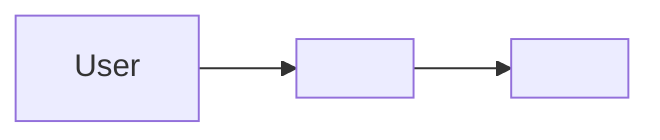
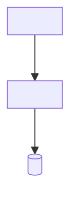

# System Design — Template

> **Inputs:** Requirements, constraints. **Outputs:** feeds DB Design, API Design, Task Breakdown.
> _Copy, delete guidance, fill in. Keep it high-level: components and their relationships, not
> line-by-line implementation._

> **Purpose:** Describe the high-level structure of the system and how its parts fit together.
> **Owner:** Tech Lead / Architect. **Written:** Architecture stage.
> **Changes:** when a structural decision changes (record the "why" as an [ADR](adr.md)).
> **Inputs:** Requirements. **Outputs:** DB Design, API Design, Tasks.

## Overview

_One paragraph: what the system is, at a glance._

## Context diagram

_Who/what interacts with the system from the outside._

## Components

| Component | Responsibility | Key decisions ([ADR](adr.md)) |
|-----------|----------------|-------------------------------|
| <UI> | <what it does> | <ADR-n> |
| <API> | <what it does> | <ADR-n> |
| <Data store> | <what it does> | <ADR-n> |

## Key flows

_For the most important 1–3 requirements, show how a request moves through the components._

1. **<flow name, e.g. "Complete a task">**: <user action> → <UI> → <API> → <store> → <result>.

## Non-functional considerations

| Concern | Approach |
|---------|----------|
| Performance ([NFR-n]) | <how the design meets the target> |
| Security | <trust boundaries, authn/authz approach> |
| Scalability | <what scales and how> |
| Failure modes | <what happens when a component fails> |

## Decisions

_List the ADRs this design depends on, with a one-line summary each._

- [ADR-1](adr.md): 

