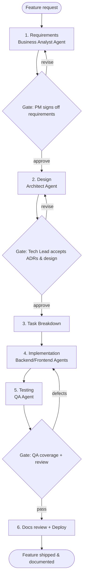

# Workflow — New Feature

> **Purpose:** The end-to-end path for adding a new feature to an existing project.
> **Owner:** Product Manager (overall); step owners noted below.
> **Written:** Foundational (reference workflow).
> **Changes:** when the feature path changes.
> **Inputs:** a feature request/idea. **Outputs:** a shipped, documented, tested feature.
> **Dependencies:** [`workflow-spec.md`](workflow-spec.md).

## Purpose

Use this when adding a distinct new capability to a project that already exists. For one-line
fixes use the (planned) Bug Fix workflow; for structural change, start from Architecture.

## Trigger

A stakeholder requests a new capability, or a Goal implies one that isn't yet built.

## Flow diagram

## Steps

| # | Step | Who acts | Reads (Inputs) | Writes (Outputs) |
|---|------|----------|----------------|------------------|
| 1 | **Requirements** | [Business Analyst Agent](../agents/roles/business-analyst.md), PM decides | scope, goals | new/updated user stories + `AC` in the requirements doc |
| 2 | **Design** | [Architect Agent](../agents/roles/architect.md), Tech Lead decides | requirements | system-design update + [ADR](../templates/adr.md)(s) |
| 3 | **Task Breakdown** | PM/Tech Lead + agent | requirements, design | [tasks](../templates/task.md), each traced to a `US`/`AC` |
| 4 | **Implementation** | Backend/Frontend agents, engineer steers | tasks, design | code + updated docs |
| 5 | **Testing** | [QA Agent](../agents/roles/qa.md), QA Lead decides | `AC` IDs, code | tests (traced to `AC`) + test report |
| 6 | **Docs review + Deploy** | Doc/DevOps agents, human approves | all docs, passing build | doc sign-off, release + release notes |

## AI involvement

Agents draft at every step — stories, ADRs, tasks, code, tests, release notes. Each agent stays
within its [boundaries](../agents/agent-model.md) and stops at its human gate. No agent finalizes
a decision, closes a stage, or approves a release on its own.

## Human checkpoints

- **G1 — Requirements sign-off (PM):** the stories and criteria are correct and in scope.
- **G2 — Design acceptance (Tech Lead):** ADRs move from *Proposed* to *Accepted*; design approved.
- **G3 — Test & readiness (QA Lead + release owner):** every `AC` has a passing test; open
  defects are triaged and accepted or fixed.

## Deliverables

- Updated requirements, system design, and ADRs.
- Tasks, all traced to requirement IDs.
- Code implementing the feature.
- Tests, all traced to acceptance criteria, passing.
- Updated documentation and release notes.

## Definition of done

The feature is shipped **and** every artifact traces end to end:
`requirement → task → code → test → release`, with all three human gates approved and docs
matching reality (Principle 6). See this instantiated in the
[Todo example](../../examples/todo/README.md).
