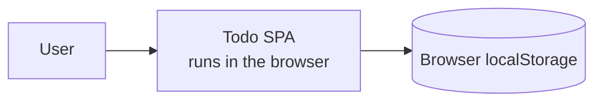
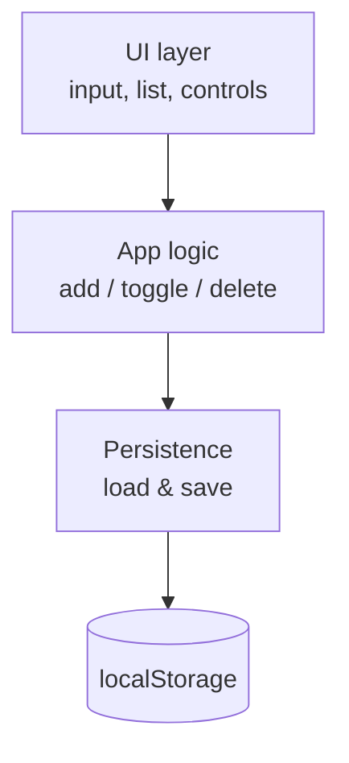

# Todo App — Architecture

> **Purpose:** Describe the high-level structure of the Todo app and record the key decision.
> **Owner:** Tech Lead (example). **Written:** Architecture stage.
> **Changes:** when a structural decision changes (recorded as a new ADR).
> **Inputs:** [02-requirements.md](02-requirements.md). **Outputs:** [04-tasks.md](04-tasks.md),
> [05-testing.md](05-testing.md).
> **Built from:** [system-design template](../../docs/templates/system-design.md),
> [ADR template](../../docs/templates/adr.md).

## Overview

A client-only, single-page web app. There is no server: the browser holds the UI, the app logic,
and the data. This is the simplest structure that satisfies the requirements — and the "no
backend" constraint (from [Requirements](02-requirements.md#constraints)) makes it the right one.

## Context diagram

## Components

| Component | Responsibility | Key decision |
|-----------|----------------|--------------|
| UI layer | Render the input, list, empty state, and per-task controls | — |
| App logic | Add, toggle-complete, and delete tasks; hold in-memory state | — |
| Persistence | Load state on startup, save on every change | [ADR-1](#adr-1-persist-state-in-browser-localstorage) |
| localStorage | Durable per-browser key/value store | [ADR-1](#adr-1-persist-state-in-browser-localstorage) |

## Key flows

1. **Complete a task (US-3):** user toggles checkbox → App logic flips the task's `done` flag →
   Persistence saves state → UI re-renders the "done" style. On next load, Persistence reads the
   saved state so the flag survives (AC-3.3 / AC-5.1).

## Non-functional considerations

| Concern | Approach |
|---------|----------|
| Responsiveness (NFR-1) | All work is in-memory + a synchronous `localStorage` write; well under 100 ms for personal-scale lists. |
| No setup (NFR-2) | No server, no account — the app works on first load. |
| Accessibility (NFR-3) | Native form controls with labels; full keyboard operation. |
| Failure modes | If `localStorage` is unavailable/cleared, the app still runs in-memory for the session and shows the empty state on next load (consistent with the Vision risk note). |

## Decisions

### ADR-1: Persist state in browser localStorage

- **Status:** Accepted
- **Date:** 2026-07-27
- **Deciders:** Tech Lead (example)
- **Relates to:** GOAL-1, US-3 (AC-3.3), US-5 (AC-5.1, AC-5.2), the "no backend" constraint

**Context.** Requirements demand that tasks persist across refresh and browser restart (US-5),
but a constraint rules out a backend server in v1. We need durable, per-device storage available
with no setup.

**Options considered.**

| Option | Pros | Cons |
|--------|------|------|
| **A. `localStorage`** | Built into every browser; synchronous & simple; no setup; survives restart | Per-browser only; ~5 MB limit; user can clear it |
| **B. `IndexedDB`** | Larger, async, structured | Overkill for a small list; more code/complexity |
| **C. In-memory only** | Trivial | Fails US-5 outright (lost on refresh) — disqualified |

**Decision.** We will **persist all task state in the browser's `localStorage`**, loading on
startup and saving on every change.

**Rationale.** `localStorage` is the least complex option that satisfies US-5 within the
no-backend constraint. `IndexedDB`'s capacity and async model buy nothing for a personal list;
in-memory can't meet persistence at all. The known limits (per-browser, clearable) are already
accepted as non-goals/risks in the [Vision](01-vision.md#assumptions--risks).

**Consequences.**
- **Positive:** zero infrastructure; instant load; satisfies GOAL-1/US-5 directly.
- **Trade-offs:** no cross-device sync (explicit non-goal); data lost if the user clears storage
  (explicitly out of scope).
- **Follow-ups:** [TASK-3](04-tasks.md#task-3-load-and-save-state-in-localstorage) implements the
  persistence layer; [TEST-12](05-testing.md) proves completion survives a refresh.

**Compliance.** A persistence test (TEST-11/12/15) in [05-testing.md](05-testing.md) verifies the
decision is actually in effect.
