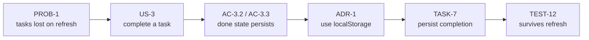

# Example — Todo Application

> **Purpose:** Show ThinkFlow applied end-to-end to a small, familiar project, so the
> methodology — not the domain — is what you're learning.
> **Owner:** Example maintainers.
> **Reads like:** the documents a real team would produce, in lifecycle order.
> **Related:** [lifecycle](../../docs/methodology/lifecycle.md), [templates](../../docs/templates/),
> [New Feature workflow](../../docs/workflows/new-feature.md).

This example documents a deliberately simple product — a personal todo app — from idea to a
tested, shippable feature set. We keep the domain trivial on purpose: the point is to see the
**documents and their traceability**, not to be impressed by the app.

## Read in this order

| # | Document | Lifecycle stage | Built from template |
|---|----------|-----------------|---------------------|
| 1 | [01-vision.md](01-vision.md) | Vision | [vision](../../docs/templates/vision.md) |
| 2 | [02-requirements.md](02-requirements.md) | Requirements | [requirements/PRD](../../docs/templates/requirements-prd.md) |
| 3 | [03-architecture.md](03-architecture.md) | Architecture | [system-design](../../docs/templates/system-design.md) + [ADR](../../docs/templates/adr.md) |
| 4 | [04-tasks.md](04-tasks.md) | Task Breakdown | [task](../../docs/templates/task.md) |
| 5 | [05-testing.md](05-testing.md) | Testing | [testing-strategy](../../docs/templates/testing-strategy.md) |

## The point of this example: the traceability chain

Everything below traces to the problem it serves. Pick any test and walk left to the problem;
pick the problem and walk right to the proof it's handled. This is the property ThinkFlow exists
to produce.

Worked out in full:

| Problem | Story | Criterion | Decision | Task | Test |
|---------|-------|-----------|----------|------|------|
| **PROB-1** — a captured task must not disappear on refresh | **US-3** — complete a task | **AC-3.3** — completed state persists across refresh | **ADR-1** — persist state in browser `localStorage` | **TASK-7** — persist task completion | **TEST-12** — completion survives a page refresh |

Follow the links in each document to see every hop. If any hop were missing — a task with no
requirement, a criterion with no test — that would be a defect the [checklists](../../docs/checklists/)
are designed to catch.
